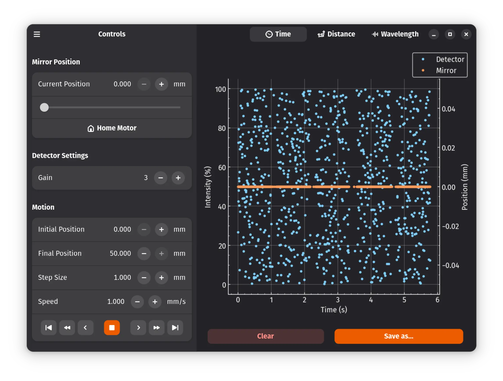
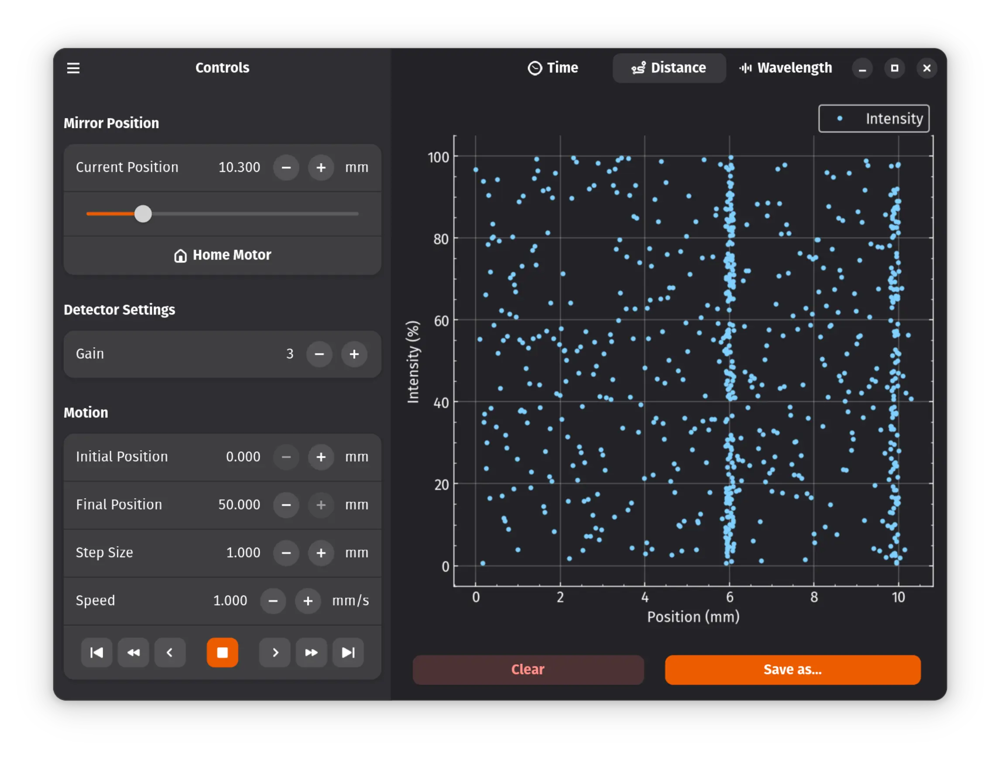
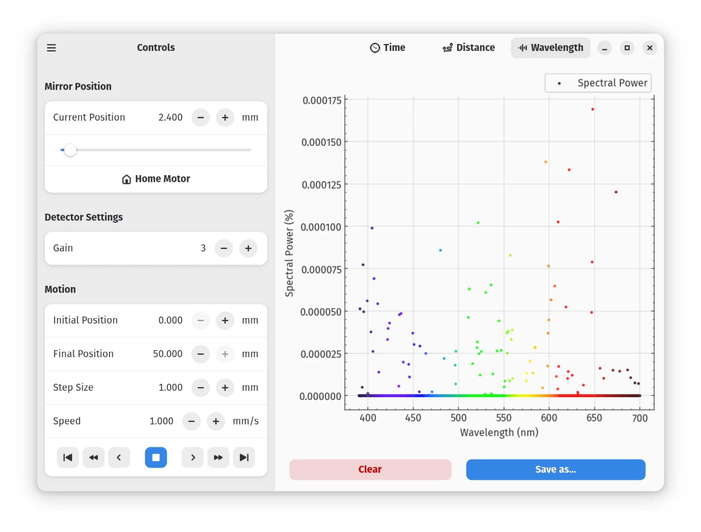
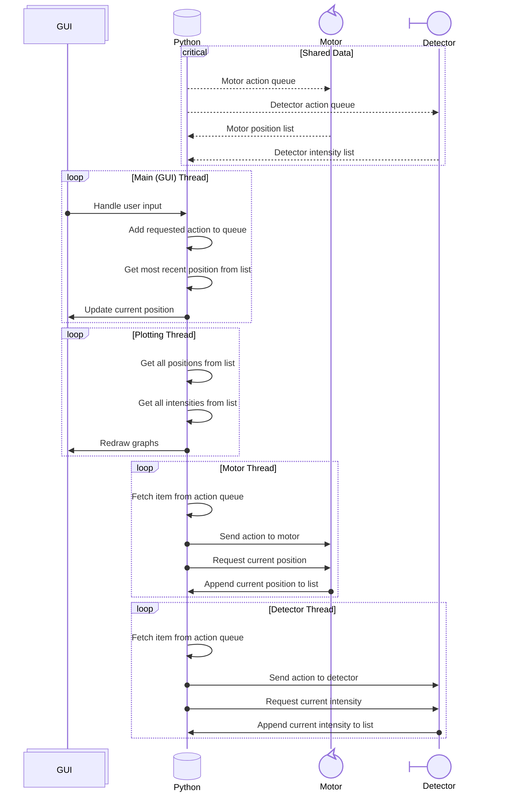
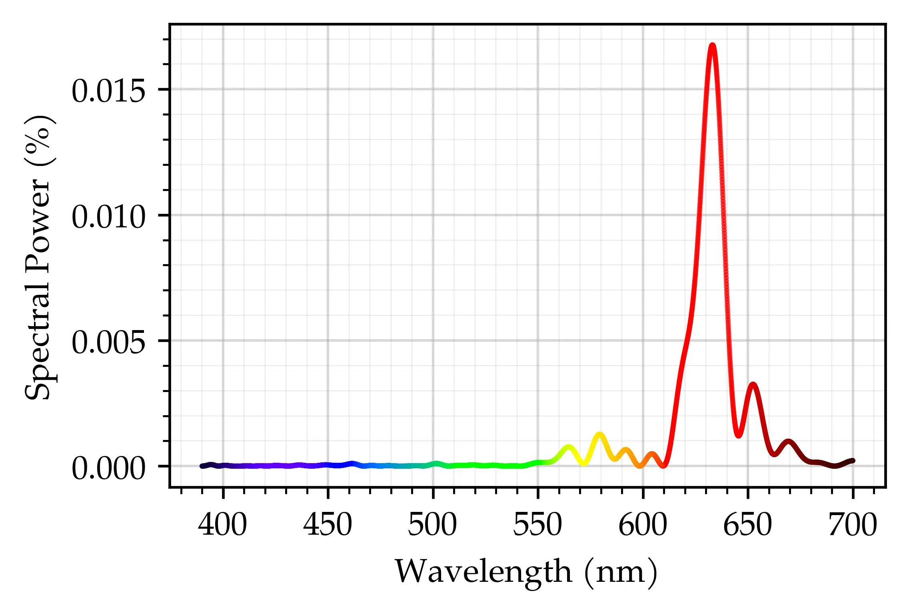

<!-- Michelson Interferometer Control Software
     https://github.com/gucci-on-fleek/michelson-interferometer
     SPDX-License-Identifier: MPL-2.0+ OR CC-BY-SA-4.0+
     SPDX-FileCopyrightText: 2026 Max Chernoff
-->

Michelson Interferometer Control Software
=========================================

This repository contains a Python/GTK-based GUI used to control the
Michelson Interferometer used in the University of Calgary Senior
Physics Lab.


Installation
------------

### Student Instructions

1.  Install Flatpak. This should already be installed for you on the lab
    computers; if not, a staff member will need to install it as root by
    running:

    ```console
    $ sudo apt install flatpak
    ```

2.  Download the latest Flatpak bundle, either manually from the
    [releases
    page](https://github.com/gucci-on-fleek/michelson-interferometer/releases),
    or by running:

    ```console
    $ cd ~/Downloads/
    $ wget https://github.com/gucci-on-fleek/michelson-interferometer/releases/latest/download/ca.maxchernoff.michelson_interferometer.flatpak
    ```

3.  <a name="symlink-home"></a>(Optional) OSTree is _insanely_ slow
    over NFS, so if you're installing this as an unprivileged user, you
    should link your Flatpak installation folder to a local directory to
    speed things up:

    ```console
    $ mkdir -p /var/tmp/$USER/flatpak
    $ ln -sf /var/tmp/$USER/flatpak ~/.local/share/flatpak
    ```

4.  [Enable the Flathub repository](https://flathub.org/en/setup), which
    is required to install the application's dependencies:

    ```console
    $ flatpak remote-add --user --if-not-exists flathub https://dl.flathub.org/repo/flathub.flatpakrepo
    ```

5.  Install the Flatpak bundle by running:

    ```console
    $ flatpak install --user ~/Downloads/ca.maxchernoff.michelson_interferometer.flatpak
    ```

    Say “yes” (type `y` and press enter) to any prompts.

> [!TIP]
> This should only take a minute or two to install; if it takes much
> longer, you likely skipped [step 3](#symlink-home) above.


### Staff Instructions

The above instructions must be repeated by _every_ user who wishes to
use the interferometer software, and is somewhat ephemeral since the
software is installed to `/var/tmp/`. However, if you install the
software as root, it will be available to _all_ users on the system, and
it will be permanent since it will be installed to `/var/lib/'.

To install the software as root, follow the [above
instructions](#student-instructions), but skip [step 3](#symlink-home),
replace `--user` with `--system` in the commands, and run them as root
(using `sudo`).


Launching
---------

### Basic

After you've installed the Flatpak, there should be a new entry in your
application menu called “Michelson Interferometer”; to launch it, simply
click on its icon.

If the icon doesn't show up, first try restarting your computer. If it
still doesn't show up, you can always launch this program manually by
running:

```console
$ flatpak run ca.maxchernoff.michelson_interferometer
```

### Advanced

If you run the Flatpak from the root of this Git repository, it
will use the source code in that directory; otherwise, it will use the
bundled code.

Or if you want to run a modified version, run:

```console
$ git clone https://github.com/gucci-on-fleek/michelson-interferometer.git
$ cd michelson-interferometer/
[make your changes]
$ make run-flatpak  # Using the Makefile properly rebuilds all the necessary files
```

Or if you want to open a Python REPL with the Flatpak's Python
interpreter (and all its included packages), run:

```console
$ flatpak run ca.maxchernoff.michelson_interferometer -i
```

For local development, you can set the `MI_FAKE_DEVICES` environment
variable to use random data instead of real hardware devices:

```console
$ MI_FAKE_DEVICES=1 make run-flatpak
```


Usage
-----

Once you've launched the application, the GUI will open to the main
screen, the motor will calibrate itself, and the data collection will
immediately start.


#### “Controls” Section

| Item | Description |
|:--|:--|
|  | The menu shows the details about the application. |
| Current position  | Shows the current position of the motor relative to the starting position. You can move the slider or manually type in a new position and the motor will move to that position. |
| Home Motor  | Recalibrates the motors position and sends it to the zero position. |
| Gain | Sets the gain of the detector to an integer between 0 and 4. |
| Initial Position | The smallest position the motor will move to. |
| Final Position | The largest position the motor will move to. |
| Step Size | The distance the motor will move when stepped ahead or back. |
| Speed | The speed at which the motor will move when moving continuously. |
|   | Quickly move the motor to the initial or final position. |
|   | Continuously move the motor at the specified speed towards the initial or final position. |
|   | Move the motor ahead or back by the step size. |
|  | Stop any motion in progress. |
| Clear | Erase all data collected so far. |
| Save as… | Save the data collected so far to a <abbr>TSV</abbr> file. |


#### “Time” Tab



The “Time” tab displays all data collected so far: it displays both the
light intensity measured by the detector and the position of the motor
as functions of time since last clearing the data. In typical usage, you
should see the motor position increasing linearly while the light
intensity oscillates as the interference pattern is scanned.


#### “Distance” Tab



The “Distance” tab displays the light intensity measured by the detector
as a function of the position of the motor. Since the motor typically
moves at a constant speed, this graph should look similar to the “Time”
graph, modulo some scaling.


#### “Wavelength” Tab



The “Wavelength” calculates the Lomb–Scargle periodogram of the data
collected so far, and displays the spectral power as a function of
wavelength. The peak wavelength displayed here should correspond to the
wavelength of the light source used in the interferometer.


Tips
----

- Changing the speed of the motor is really buggy, so if it's not
  working, you'll probably have to restart the application.

- The application crashes occasionally, so you should save your data
  often. Saving data does _not_ clear the data or interrupt the data
  collection, so you can save as often as you like.

- The application has full support for light mode and dark mode, and
  follows the system theme. Reducing the ambient light in the room while
  measuring the interference pattern will improve your results, so
  switching to the dark theme is _strongly_ recommended.


Technical Details
-----------------

### Why Flatpak?

- Because I wanted to use GTK 4/Adwaita, but neither of these were
  installed on the lab computers.

- Because the lab computer's software is all 5 years older than the
  software on my personal computer, and I wanted to use the same
  versions on both to avoid any compatibility issues.

- Because I needed to use multiple third-party Python packages, and I
  didn't want to walk the other students through installing all of them
  into a virtual environment.


### Internal Architecture

Internally, the application is split into four threads, which
communicate via queues and lists. The following diagram explains the
architecture:




### Wavelength plotting

The primary goal of this lab is to determine the wavelength of the light
source used in the interferometer, and the “Wavelength” tab contains a
plot that tells you this, but its inner workings are fairly complicated.
To replicate this plot on your own, you'll want to refer to the source
code (the [`plots.py`](./michelson_interferometer/plots.py) file in
particular), but here's an abridged explanation copied from my own lab
report:

> The detector data and motor data were collected from separate threads,
> and were saved independently as a function of their respective
> timestamps. But because Linux is not a real-time operating system,
> there was considerable jitter in the timestamps, so it was impossible
> to directly pair the two datasets. In addition, the motorized mirror
> only reports its position to the nearest 0.005 mm, yet it moves
> smoothly between these reported positions. Taken together, this means
> that the position difference between consecutive detector samples is
> non-constant, therefore we cannot analyze the data with a
> <abbr>FFT</abbr>.
>
> Therefore, we processed the data as follows:
>
> 1.  The detector and motor data were imported into separate tables,
>     and the first timestamp was subtracted from all times to convert
>     them to relative times in seconds starting from zero.
>
> 2.  At the beginning and end of the dataset, the motor was not moving,
>     so we trimmed these constant position regions from both tables.
>
> 3.  To counteract the rounding of the motor positions, we kept only
>     the middle point in a run of consecutive identical motor positions
>     and dropped the rest.
>
> 4.  Now, we performed an outer join of both tables on time, keeping
>     all rows from both tables (meaning that most of the position and
>     intensity values were `null`), and then sorted the resulting table
>     by time.
>
> 5.  We then filled in any `null` position values by linearly
>     interpolating by time between the nearest adjacent positions. We
>     then dropped any rows with `null` intensity values.
>
> 6.  Our intensity values are unevenly spaced in position, and are
>     incredibly noisy, so applying a <abbr>FFT</abbr> yielded unusable
>     results. Instead, we computed a Lomb–Scargle periodogram.
>
>     We used the positions in metres as our “sample times” and the
>     intensities in percentage as our “measurement values”. We only
>     care about visible light, so we restricted our analysis to
>     wavelengths between 390 nm and 700 nm. Because the Lomb–Scargle
>     periodogram operates in frequency space, we took the reciprocal of
>     these wavelengths to get wavenumbers, multiplied the wavenumbers
>     by two since adjusting the mirror changes the path length by twice
>     the mirror movement, multiplied by $`2 \pi`$ to convert from
>     wavenumbers to angular wavenumbers, and then used these angular
>     wavenumbers as the “angular frequencies” parameter.
>
> 7.  Since the data is very noisy, we retained only the top 10% of the
>     periodogram values by subtracting the 90th percentile from all
>     values and setting any negative values to zero.
>
> 8.  Finally, we took the wavelength corresponding to the maximum value
>     in the processed periodogram as our measured wavelength. To
>     calculate the uncertainty, we measured the <abbr>FWHM</abbr> of
>     the peak around this maximum, and divided by $`2 \sqrt{2 \ln 2}`$
>     to convert from <abbr>FWHM</abbr> to standard error.
>
> | Final computed Lomb–Scargle periodogram for the red (635 nm) laser. |  |
> |:--|:--|


Support
-------

If you have any questions, the best way to reach me is by [opening a new
issue](https://github.com/gucci-on-fleek/michelson-interferometer/issues/new/choose)
or [starting a new
discussion](https://github.com/gucci-on-fleek/michelson-interferometer/discussions/new/choose)
on GitHub. If you don't have a GitHub account, [my website lists some
alternate contact methods](https://www.maxchernoff.ca/#contact).

If you would like to contribute to this project, please either [open a
new pull
request](https://github.com/gucci-on-fleek/michelson-interferometer/pulls),
email me a Git patch, or describe your changes in a new issue.


Licence
-------

This repository is licensed under the [_Mozilla Public License_, version
2.0](https://www.mozilla.org/en-US/MPL/2.0/) or greater. The
documentation is additionally licensed under [CC-BY-SA, version
4.0](https://creativecommons.org/licenses/by-sa/4.0/legalcode) or
greater.

The <abbr>SVG</abbr> icons in [`docs/assets/`](./docs/assets/) are
copied from the [Adwaita icon
theme](https://gitlab.gnome.org/GNOME/adwaita-icon-theme), and are
licensed under [CC-BY-SA, version
3.0](https://creativecommons.org/licenses/by-sa/3.0/legalcode). This
project additionally uses several third-party Python packages; for
further details, see the [`pyproject.toml`](./pyproject.toml) file.
